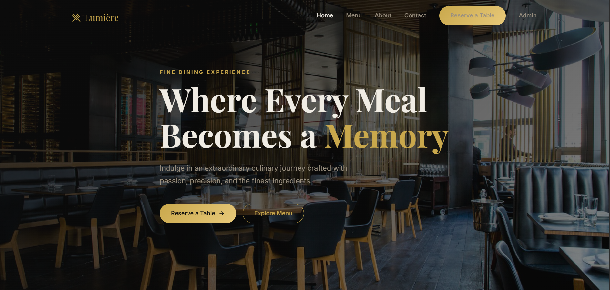
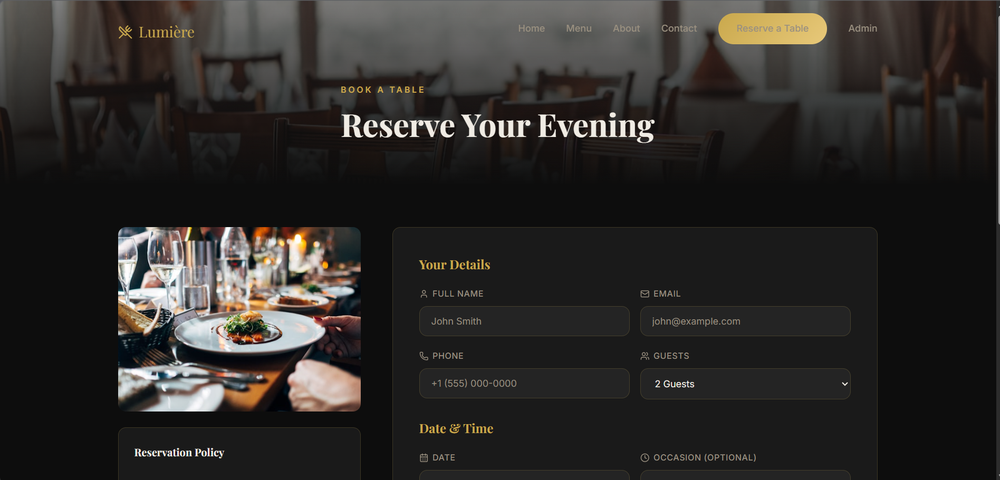

# 🍽️ Lumière – Restaurant Reservation System

A full-stack restaurant reservation system where users can book tables and admins can manage reservations in real-time.

---

## 🌐 Live App

👉 https://future-fs-03-sandy.vercel.app

---

## 🧠 Features

### 👤 User

* Book table with date, time & guests
* Add occasion & special requests
* Instant confirmation UI

### 🛠️ Admin

* Secure admin login
* View all reservations
* Update status (Confirmed / Pending / Cancelled)
* Delete reservations

---

## 🏗️ Tech Stack

* **Frontend:** React (Vite), Axios
* **Backend:** Node.js, Express.js
* **Database:** MongoDB Atlas
* **Deployment:** Vercel (Frontend), Render (API)

---

## 📡 API

Base URL:
`https://lumiere-backend-r5vv.onrender.com/api`

---

## 📸 Screenshots

### Welcome Page



### Reservation Page



---

## ⚙️ Local Setup

```bash
git clone https://github.com/Mr-Zenn/FUTURE_FS_03.git
cd FUTURE_FS_03
```

```bash
cd server && npm install
cd ../client && npm install
```

```bash
# backend
cd server && npm run dev

# frontend
cd client && npm run dev
```

---

## ⚠️ Notes

* Email confirmation is UI-only (no SMTP yet)
* Admin authentication is basic (for demo purposes)
* Focused on full-stack integration and deployment

---

## 👨‍💻 Author

**Jay Prakash**

